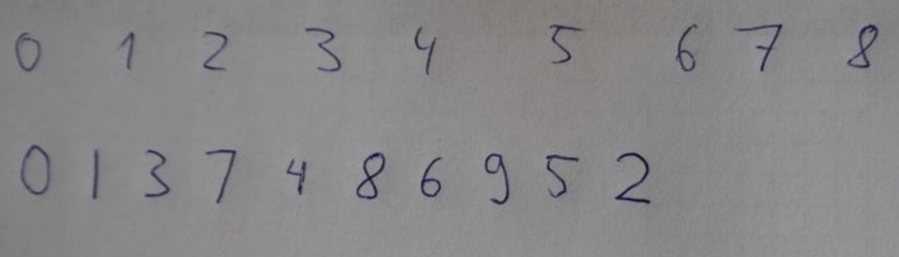
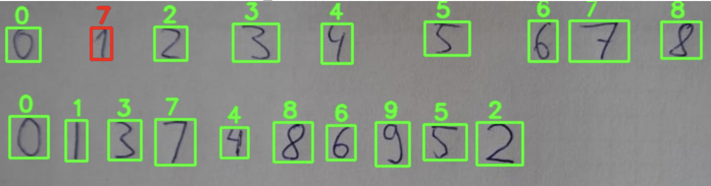

# handwriting-digit-recognition

Implement **CNN** model with **`keras`** on **MNIST** dataset (70,000 examples of handwritten english digits)

Load dataset with `fetch_openml`

Get input image and preprocess it with **`OpenCV`**

### input image :

### after `OpenCV` process :

### output :

**Right predictions : 🟩
Wrong predictions : 🟥**
